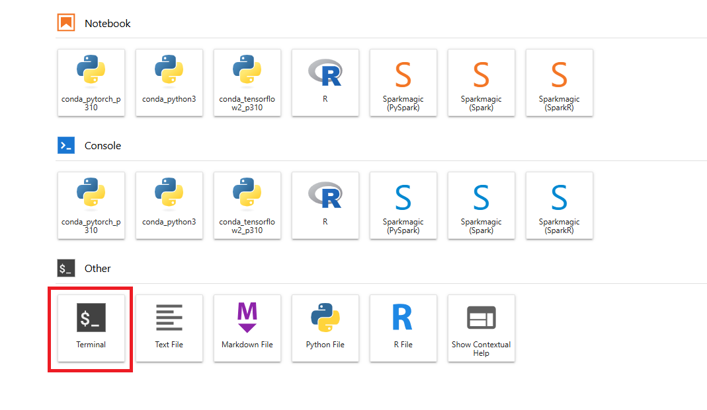
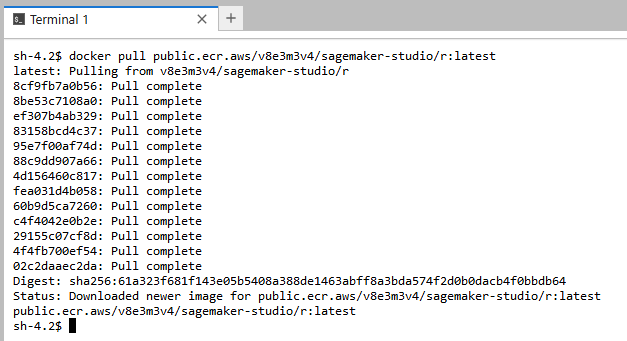
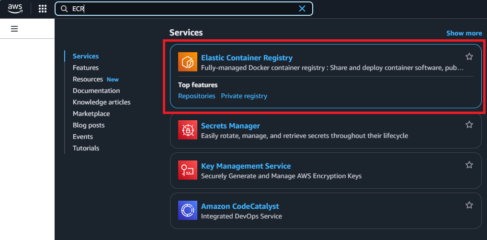
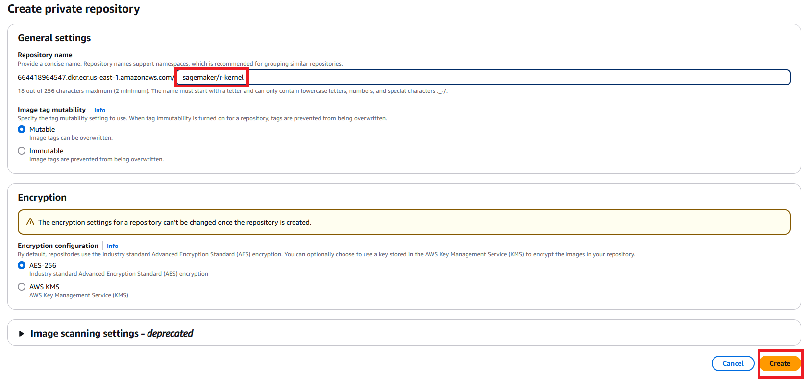
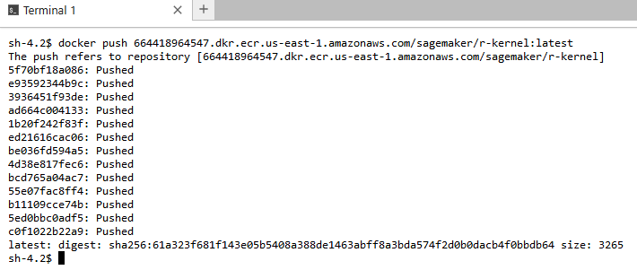

# Pushing Public Docker Images to Private ECR

We will go through how to push a public docker image to a private repository in Elastic Container Registry.

## Part 1: Pull a Docker image

* In AWS console, In a notebook instance, Open JupyterLab:

  

* Open Terminal:

  

* Pull a Docker iamge: `docker pull public.ecr.aws/v8e3m3v4/sagemaker-studio/r:latest`

  

## Part 2: Create a repository in ECR

* In AWS console, type *ECR* in search bar and then click **Elastic Container Registry**:

  

* Click **Create repository**:

  

* Give a name and then create the repository:

  

* Copy URI of your repository for the next part:

  

## Part 3: Push Docker image to ECR

* Retrieve an authentication token and authenticate your Docker client to your registry:

`aws ecr get-login-password --region us-east-1 | docker login --username AWS --password-stdin 664418964547.dkr.ecr.us-east-1.amazonaws.com/sagemaker/r-kernel`

* Tag your image so you can push the image to this repository:

`docker tag public.ecr.aws/v8e3m3v4/sagemaker-studio/r:latest 664418964547.dkr.ecr.us-east-1.amazonaws.com/sagemaker/r-kernel:latest`

* Run the following command to push this image to your newly created AWS repository:

`docker push 664418964547.dkr.ecr.us-east-1.amazonaws.com/sagemaker/r-kernel:latest`

